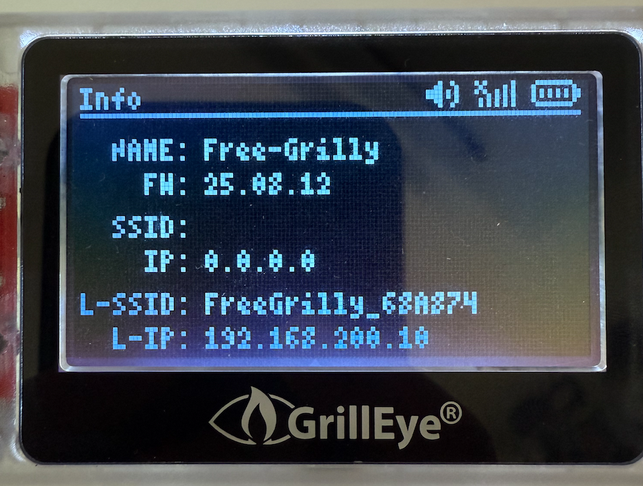
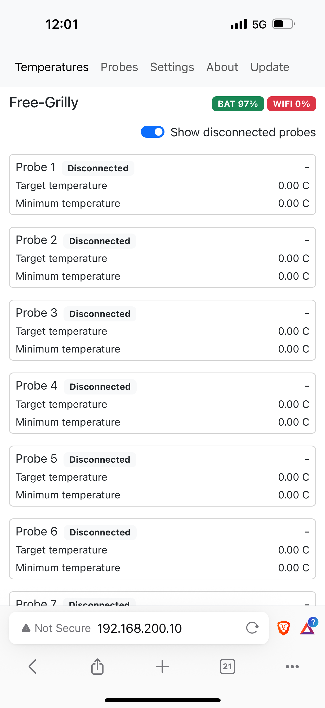
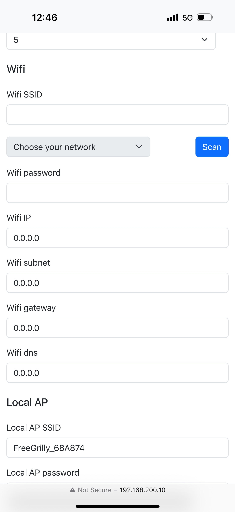
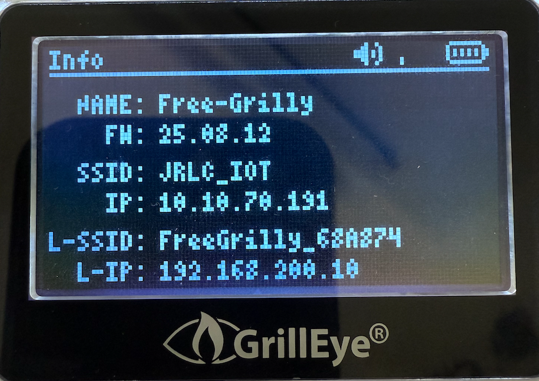

# Wi-Fi Setup Guide

This guide will walk you through connecting your device to a Wi-Fi network. Our firmware offers two ways to connect:

* **Local Access Point (AP):** The device hosts its own temporary Wi-Fi network. This is used for initial setup and configuration, or if you dont want to connect your device to your own home Wi-Fi network. 
* **Wi-Fi Client:** The device connects to your existing home Wi-Fi network, allowing you to access it from any other device on your network.

---

### Part 1: Connecting Directly via the Local Access Point (AP)

First, you'll connect directly to the device to access its settings.

1.  With the device powered on, press and hold the side button for **1-3 seconds** until you hear two short beeps. This will bring up the device's **Info Screen**.

2.  On your phone or computer, open your Wi-Fi settings and connect to the network name (SSID) shown on the `L-SSID` line of the Info Screen. By default, this network has no password.

    > **Important:** Your phone or PC might warn you that this network has "no internet connection." This is normal. If prompted, choose the option to **"Stay Connected"** or  **"Use this network anyway."**
3.  Open a web browser and navigate to the IP address shown on the `L-IP` line (the default is `192.168.200.10`). You should now see the device's web interface.

### Part 2: Connecting the Device to Your Home Wi-Fi

Now that you are in the web interface, you can configure the device to join your home network.

1.  In the menu bar, select **Settings** and scroll down to the **Wi-Fi** section.
2.  Click the **Scan** button and wait for the list of available networks to appear.

3.  Select your home network from the list and enter your Wi-Fi password.
4.  Scroll to the bottom of the page and click **Save**.
5.  The device will then connect to your network. You can verify this by bringing up the Info Screen again; it should now display a new IP address assigned by your home router.

### Part 3: Accessing the Device on Your Home Network

Once the device is connected to your home Wi-Fi, you can access it like any other network device.

1.  Reconnect your phone or computer back to your primary home Wi-Fi network.
2.  Open a web browser and enter the **new** IP address shown on the device's Info Screen (on the `IP` line).
3.  You can now interact with your device from anywhere on your local network.

    > **Info:** In case you want to fully reset your device you can hold the side button for **10+ seconds** until you hear three long beeps. This will reset all settings to default and forget your wifi credentials.