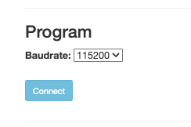
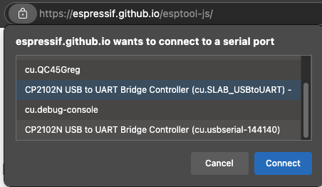
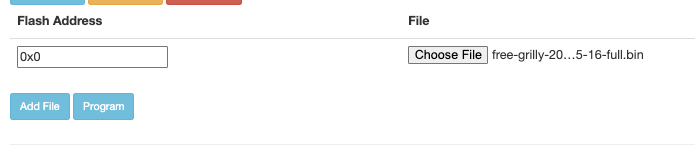
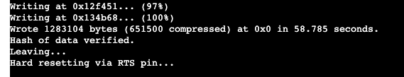
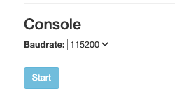
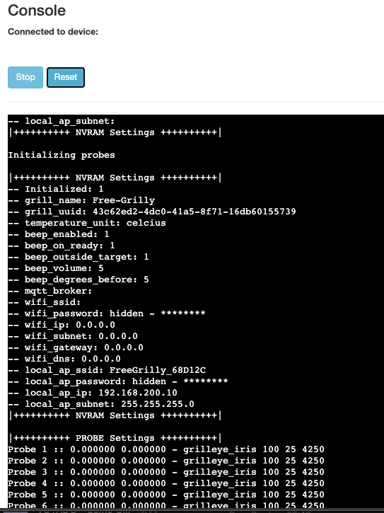

# Flashing guide

## Prerequisites

Before you begin, ensure you have the following:

* **Hardware:**
    * A Grilleye Max device.
    * A USB cable to connect the Grilleye Max to your computer.
* **Software:**
    * A computer running Windows, macOS, or Linux.
    * [CP210x USB to UART Bridge Drivers](https://www.silabs.com/developers/usb-to-uart-bridge-vcp-drivers) installed. Download and install the drivers appropriate for your operating system.
* **Firmware File:**
    * Download the latest `free-grilly-xxxx-xx-xx-full.bin` file from the [Releases page](https://github.com/epiecs/free-grilly/releases) of this repository. Make sure to use the `full` variant.

## Flash via the expressif web interface - short version without screenshots

1. Surf to [https://espressif.github.io/esptool-js/](https://espressif.github.io/esptool-js/) using a chrome based browser Chrome/Edge
2. Under **program** select a baudrate of `115200`
3. Click connect and choose the correct device from the list. Look for a device with **CP2102N** in it's name
4. Set the flash address to `0x0` and select the latest `full` firmware.
5. Click on **program** and wait for the programming to finish
6. Refresh the webpage
7. Under console select a baudrate of `115200` and click on **start**
8. Select your correct device again
9. Click the reset button
10. You should now see output in the console
11. Boot your free grilly by holding the side button until you hear beaping

## Flash via the expressif web interface - long version with screenshots

1. Surf to [https://espressif.github.io/esptool-js/](https://espressif.github.io/esptool-js/) using a chrome based browser Chrome/Edge
2. Under **program** select a baudrate of `115200`
    
    

3. Click connect and choose the correct device from the list. Look for a device with **CP2102N** in it's name

    

4. Set the flash address to `0x0` and select the latest `full` firmware.

    

5. Click on **program** and wait for the programming to finish

    

6. Refresh the webpage
7. Under console select a baudrate of `115200` and click on **start**

    

8. Select your correct device again
9.  Click the reset button

    

10. You should now see output in the console
11. Boot your free grilly by holding the side button until you hear beaping

## Manual Flashing via USB if the web browser does not work

This process will replace the original firmware on your Grilleye Max.

- Extra prerequisits
    - [Python](https://www.python.org/downloads/) installed.
    - [esptool.py](https://github.com/espressif/esptool): Install it via pip: `pip install esptool`
        -You can also download premade binaries for Windows/Linux/Mac: https://github.com/espressif/esptool/releases (for intel macs use https://github.com/espressif/esptool/releases/tag/v4.5.1)

> **Watch out!:** For the first flash you will need to use the `full` variant of the firmware. This contains extra data which is not included in the normal updates (bootloader, partitions,...).

1.  **Connect the Device:** Connect your Grilleye Max to your computer using the USB cable.
2.  **Find Your Serial Port:**
    - **Windows:** Open Device Manager (search `devmgmt.msc`). Look under "Ports (COM & LPT)". You should see an entry like "Silicon Labs CP210x USB to UART Bridge (COMx)". Note the `COMx` number (e.g., `COM3`).
    - **macOS:** Open Terminal and run `ls /dev/cu.*`. Look for something like `/dev/cu.usbserial-XXXX` or `/dev/cu.SLAB_USBtoUART`.
    - **Linux:** Open Terminal and run `ls /dev/ttyUSB*`. Look for something like `/dev/ttyUSB0`.
3.  **Flash the Firmware:**
    - Open your Terminal or Command Prompt.
    - Navigate to the directory where you downloaded the `free-grilly.bin` file.
    - Run the `esptool.py` command, replacing `<YOUR_SERIAL_PORT>` with the port name you found in step 2:

        ```bash
        esptool.py --port <YOUR_SERIAL_PORT> write_flash 0x0 free-grilly.bin
        ```
        *Example for Linux:* `esptool.py --port /dev/ttyUSB0 write_flash 0x0 free-grilly-merged-yyyy-mm-dd.bin`
        *Example for Windows:* `esptool.py --port COM3 write_flash 0x0 free-grilly-merged-yyyy-mm-dd.bin`
        *Example for macOS:* `esptool.py --port /dev/cu.SLAB_USBtoUART write_flash 0x0 free-grilly-merged-yyyy-mm-dd.bin`

4.  **Wait:** The flashing process will take a minute or two. Do not disconnect the device. `esptool.py` will indicate when it's complete.
5.  **Reboot:** Once flashing is successful, disconnect and reconnect the USB cable, or power cycle the device. To start the device hold the power button until the Grilleye beeps.