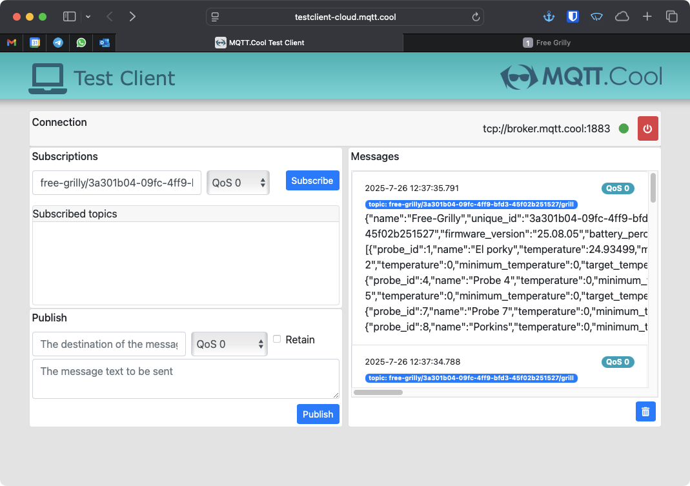

# MQTT

Free-Grilly also supports sending and receiving data via a mqtt broker.

You can set your prefix, mqtt broker and port in the settings. The default prefix is **`free-grilly`**

The data being sent and received is in the json format. This is the same data that is sent and received by the rest api. For a in depth spec you can reference the [openapi](./openapi.yaml) file.

## Topics

The following topics are provided:

The default prefix is `free-grilly` and the uuid is in the format of a UUIDv4 generated on first boot.

- Publishing
    - `<prefix>/<uuid>/grill`
    - `<prefix>/<uuid>/probes`
    - `<prefix>/<uuid>/settings`
- Subscribing
    - `<prefix>/<uuid>/config/probes`
    - `<prefix>/<uuid>/config/settings`

A full example looks like `free-grilly/43c62ed2-4dc0-41a5-8f71-16db60155739/grill`.

The `grill` topic is sent every second. The `probes` and `settings` topic is only used if you change your probe or your grill settings on free-grilly.

When publishing to the `probes` and `settings` topic the messages will have their **retain** flag set to true. That way the latest known settings are always available for whoever subscribes.

For the topics that Free-Grilly is subscribed to (`/config/probes` and `/config/settings`), Free-Grilly takes into account that there might be a message with the retain flag set. So after reading the message Free-Grilly will also publish a new message with retain set to true and a 0 byte payload to clear the existing message.

## Testing your MQTT connection

Mqtt is basically fire and forget. Free-grilly will send mqtt data to whatever broker you have provided. If that broker exists, or is even listening is not something that Free-grilly cares about. This is just the nature for how mqtt works (unless you set specific qos flags).

This makes mqtt sometimes a bit difficult to debug. An easy way to test your mqtt settings is by using one of the free mqtt brokers and a test client.

A free to use tool is the [mqtt.cool testclient](https://testclient-cloud.mqtt.cool).

Click on connect and you will see a dashboard waiting to be configured:

In this example we are connected to the mqtt.cool broker: `broker.mqtt.cool`.

First we have to configure our free-grilly. Open your free-grilly and go to the settings page and scroll down to the mqtt section. Here you can fill in the broker `broker.mqtt.cool`. **Don't forget to save your settings.**

As you can see the topics are automatically generated for you. For now just copy the wildcard topic (the one ending in #). When using Mqtt you can use `#` as a wildcard character and this will give you all matches. In this case the grill, probes and settings topic.

Now go back to the mqtt.cool dashboard, fill in. the wildcard topic and click subscribe. You will now start to see mqtt messages coming in:

